# 3D Deep Learning 67801 - Exercise 2 | Problem 1 - Report

**Hadar Hever, Yaara Bergfroind**

---

## A. Short-Answer Questions
### 1. Why are the MLP reconstructions so much less detailed than those produced by the SIREN?

ReLU MLPs suffer from **spectral bias**: they learn low-frequency, smooth structure in $(x,y)$ much faster than the high frequencies needed for edges and fine texture. Because ReLU layers are piecewise linear, the fitted field stays largely piecewise linear over coordinate space and cannot efficiently represent sharp or rapidly varying detail. SIRENs use sine activations with $\omega_0$ and SIREN-specific initialization so the network can represent a broad range of spatial frequencies from early training, better matching an image as a neural field and yielding sharper reconstructions.

### 2. The image Laplacian produced by the MLP looks strange… what’s happening here and why?

This happens because a ReLU network is **piecewise linear** in coordinates: the Laplacian is zero wherever activations are fixed, with sparse spikes only at ReLU boundaries—so the panel highlights representation artifacts rather than semantic edges.

---

## B. Hyperparameter sweep and model selection
Shared settings for all runs: `ImageDataset(height=128)`, `total_steps=2000`, `steps_til_summary=500`, `set_seed(0)`, Adam optimizer, MSE loss. SIREN runs use `hidden_layers=3` throughout; default head is **linear last** (`last_layer_linear=True`, paper-style), with a few sine-last runs for comparison.

For each sweep we list final PSNR in a table, give a short analysis per configuration, show field and training curves for selected runs, and include a bar chart comparing PSNR across all runs in that sweep.

### 1. MLP sweep

| Run | Width | Hidden layers | Activation | LR | Notes | PSNR (dB) |
|:---:|:-----:|:-------------:|:----------:|:--:|:------|----------:|
| M1 | 128 | 3 | ReLU | $10^{-4}$ | Baseline | 10.46 |
| M2 | 256 | 3 | ReLU | $10^{-4}$ | Wider | 12.02 |
| M3 | 128 | 6 | ReLU | $10^{-4}$ | Deeper | 13.00 |
| M4 | 128 | 3 | Tanh | $10^{-4}$ | Smooth activation | 8.62 |
| M5 | 128 | 3 | ReLU | $10^{-3}$ | LR high | 12.31 |
| M6 | 128 | 3 | ReLU | $10^{-5}$ | LR low | 6.72 |

#### M1 — Baseline (10.46 dB)

This is our reference ReLU MLP: blurry reconstruction and a Laplacian that spikes on ReLU boundaries rather than on true image edges, which is typical **spectral bias** at this resolution and step budget. Later runs are judged relative to this PSNR and these visuals.

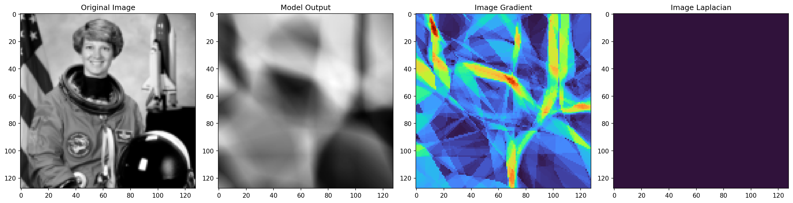

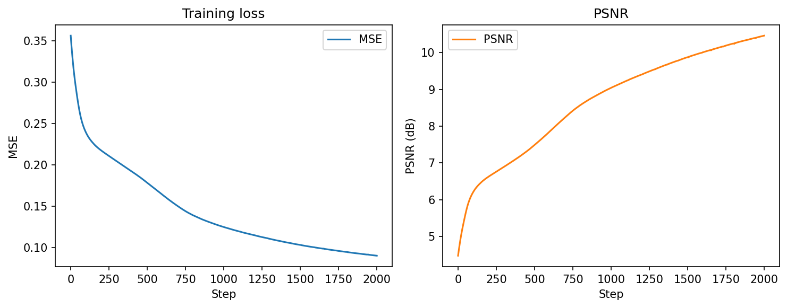

#### M2 — Wider (12.02 dB, +1.56 vs M1)
Doubling `hidden_features` adds capacity: more ReLU “pieces” over $(x,y)$, so the field can approximate slightly sharper variation. PSNR improves, but the reconstruction is still smooth compared with SIREN because the **inductive bias** (piecewise-linear ReLU) is unchanged.

#### M3 — Deeper (13.00 dB, +2.54 vs M1)
Depth helps more than width here (**best MLP**, 13.00 dB), with gradients that better follow image edges, but the reconstruction stays blurry next to SIREN. The Laplacian panel is flat, as expected for a piecewise-linear ReLU field (zero second derivative almost everywhere).

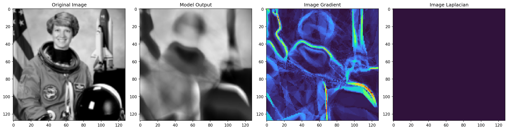

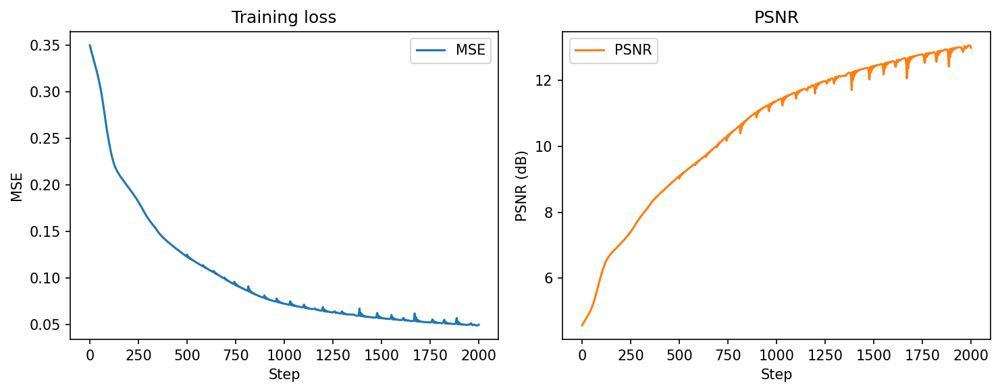

#### M4 — Tanh activation (8.62 dB, −1.84 vs M1)
Although tanh is smooth (which could lead us to think it would provide better gradients compared to ReLU activations), we see that it perform significantly worse. This is probably due to the fact it saturates at high values, leading to very small gradients.

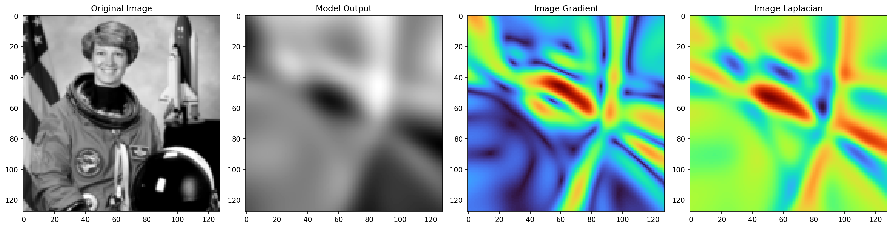

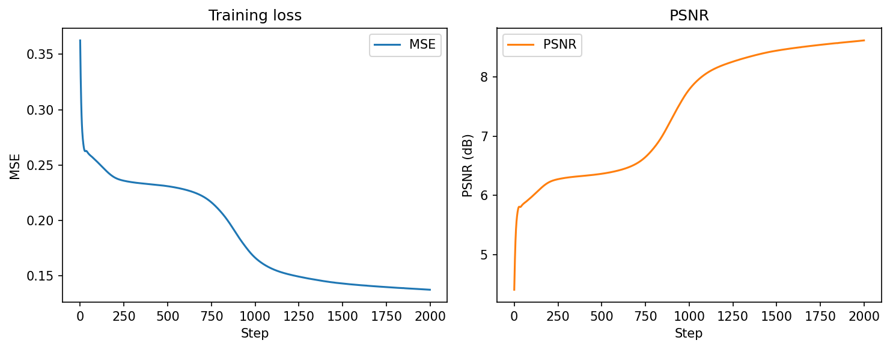

#### M5 — Higher LR (12.31 dB, +1.85 vs M1)

With only 2000 steps, $10^{-3}$ takes larger Adam steps and reduces MSE faster than $10^{-4}$ before training stops. This is mainly **more optimization progress in a fixed budget**, not a better architecture. Curves show PSNR still climbing at the end.

#### M6 — Lower LR (6.72 dB, −3.74 vs M1)

$10^{-5}$ moves weights too slowly: after 2000 steps the network is still **underfit**, especially on high frequencies. Loss and PSNR curves are flatter than M1, consistent with not having converged in the allotted steps.

---

### 2. SIREN sweep

**Bold** entries differ from the S1 baseline ($128$ features, $\omega_0=20/20$, linear last layer, $\mathrm{lr}=10^{-4}$).

| Run | Width | $\omega_0$ (1st layer) | $\omega_0$ (hidden layers) | Linear last layer | LR | Notes | PSNR (dB) |
|:---:|:-----:|:----------------:|:----------------:|:---------:|:--:|:------|----------:|
| S1 | 128 | 20 | 20 | True | $10^{-4}$ | Baseline (linear last layer) | 35.01 |
| S2 | 128 | 20 | 20 | **False** | $10^{-4}$ | Sine last layer (vs S1) | 27.41 |
| S3 | 128 | **5** | **5** | True | $10^{-4}$ | Low $\omega_0$ | 19.09 |
| S4 | 128 | **30** | **30** | True | $10^{-4}$ | High $\omega_0$ | 41.81 |
| S5 | 128 | **30** | **30** | **False** | $10^{-4}$ | High $\omega_0$ + sine last (vs S4) | 31.32 |
| S6 | 128 | 20 | **10** | True | $10^{-4}$ | Split $\omega$ | 30.62 |
| S7 | **256** | 20 | 20 | True | $10^{-4}$ | Wider | 40.27 |
| S8 | 128 | 20 | 20 | True | **$10^{-5}$** | LR low | 21.76 |
| S9 | 128 | 20 | 20 | True | **$5 \times 10^{-4}$** | LR high | 43.52 |
| S10 | 128 | **10** | **10** | True | $10^{-4}$ | Mid $\omega_0$ | 24.72 |

#### S1 — Baseline (35.01 dB)

Paper-style SIREN (linear last layer, $\omega_0=20$) already far exceeds the best MLP (M3 at 13.00 dB): reconstruction is sharper and the gradient/Laplacian panels align more closely with image structure.

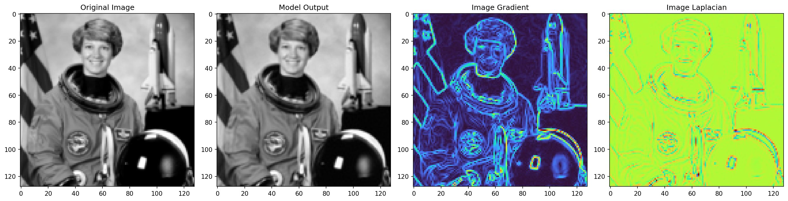

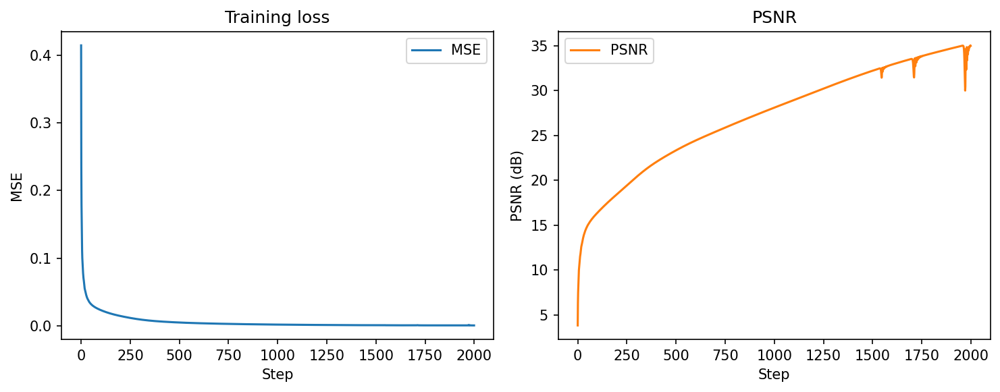

#### S2 — Sine last layer (27.41 dB, −7.60 vs S1)

Matching $\omega_0$ but using a sine output layer constrains pixel values and changes how high frequencies are composed at the head, which hurts PSNR relative to the linear last layer in S1. We can also observe some weird artifacts in the image gradient generated, and the Laplacian contains almost no signal.

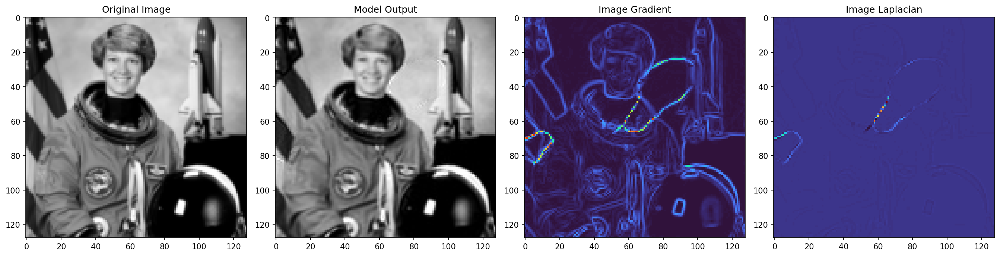

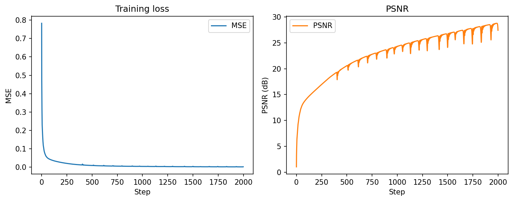

#### S3 — Low $\omega_0$ (19.09 dB, −15.93 vs S1)

With $\omega_0=5$, the network favors very low spatial frequencies and produces an overly smooth fit—similar in spirit to spectral bias in MLPs, and the weakest SIREN in the sweep. However, it still provides a fitting for the image Laplacian, which MLP models do not.

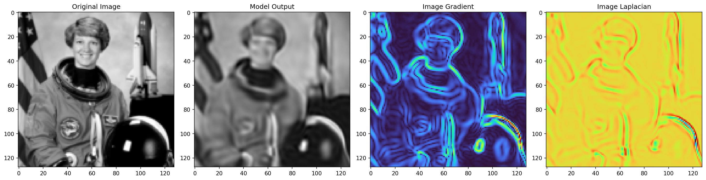

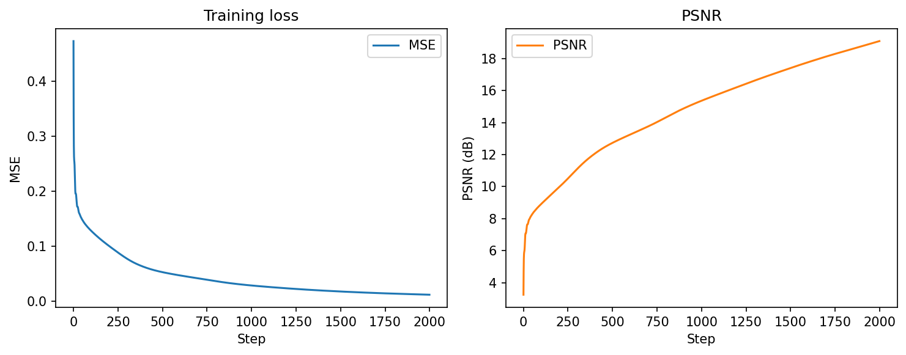

#### S4 — High $\omega_0$ (41.81 dB, +6.80 vs S1)

Raising $\omega_0$ to 30 increases the band of representable frequencies, improving edges and fine detail. PSNR gains are substantial.

#### S5 — High $\omega_0$ + sine last (31.32 dB, −10.49 vs S4)

Same high $\omega_0$ as S4 but with a sine last layer: performance drops sharply, strengthening the paper's choice for linear last layer.

#### S6 — Split $\omega$ (30.62 dB, −4.40 vs S1)

Using $\omega_0=20$ in the first layer and $10$ in hidden layers misaligns frequency bandwidth across depth and underperforms a uniform $\omega_0=20$. Intuitively, the first layer lifts coordinates into a relatively high-frequency feature space, but later layers with smaller $\omega_0$ can only mix those features with slower sinusoids—so fine detail introduced early is damped before it reaches the output.

#### S7 — Wider (40.27 dB, +5.26 vs S1)

256 hidden features add capacity for composing sinusoids over $(x,y)$ and give a large PSNR boost, nearly matching S4 without changing $\omega_0$ or LR.

#### S8 — Lower LR (21.76 dB, −13.25 vs S1)

At $\mathrm{lr}=10^{-5}$ the model underfits within 2000 steps, analogous to M6: optimization budget, not architecture, is the bottleneck.

#### S9 — Higher LR (43.52 dB, +8.50 vs S1)

**Best SIREN in the sweep.** $\mathrm{lr}=5\times10^{-4}$ converges faster and reaches the highest PSNR; metrics suggest the run is still improving at step 1999, so more steps or a schedule could help further.

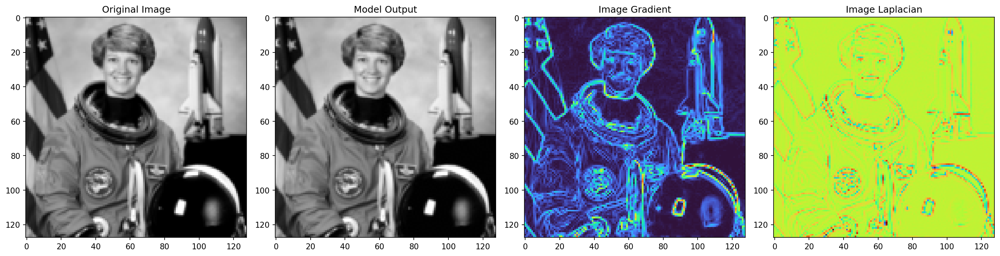

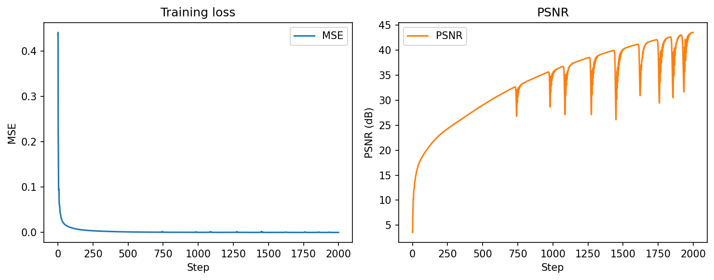

#### S10 — Mid $\omega_0$ (24.72 dB, −10.29 vs S1)

Across S3, S10, S1, and S4, PSNR rises as $\omega_0$ increases (19.1 $\to$ 24.7 $\to$ 35.0 $\to$ 41.8 dB), so **higher** $\omega_0$ helps this image fit finer spatial detail. S10 is better than the very low setting in S3 but still far below $\omega_0=20$ or $30$—there is no safe “default in the middle”; $\omega_0$ should be chosen toward the high end of what still trains stably.

### Sweep comparison (final PSNR)

Side-by-side bar charts for all MLP (M1–M6) and SIREN (S1–S10) configurations at final step (1999). SIREN reaches much higher PSNR than any MLP run; within each family, capacity and $\omega_0$/LR tuning dominate the spread.

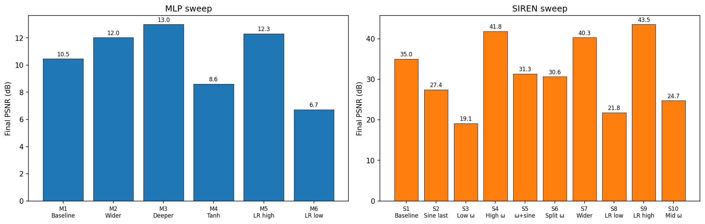

